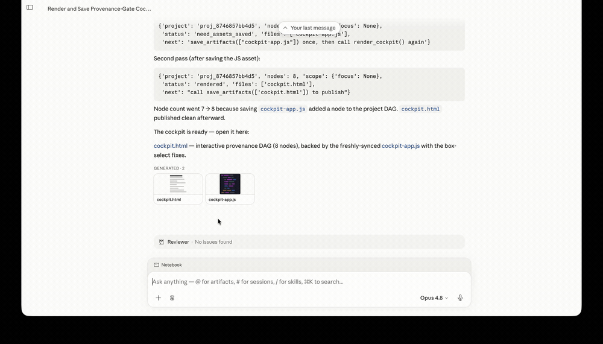

# Provenance Gate

*A deterministic, read-only trust gate for agentic science over Claude Science (CS). It flags a
result quietly built on stale or version-conflicting upstream data — a conflict that lives in the
provenance graph, not the prose.*



*The gate inside Claude Science. The agent renders the cockpit as a read-only artifact; opening it and
clicking the flagged cell shows the deterministic `version_mix` verdict, with the conflicting versions
named.*

## The problem

An agent doing research over many turns forks approaches, revises an upstream step, and re-runs. Along
the way a conclusion can come to rest on an old version of a file, or on a report that combined two
divergent versions of the same artifact. Reading the final text, an LLM reviewer often has nothing to
go on, because the conflict is in the provenance, not the prose.

## What it does

The gate reads the CS provenance DAG and computes two verdicts for each computation cell:

- `stale_input` — the cell read a version of some artifact that is no longer current.
- `version_mix` — the cell's consumed lineage reaches two live versions of the same artifact.

Both are structural facts about the graph. No model decides them: an agent can argue a flag is
harmless — one did, in testing — but a flag is a fact about the graph, not a judgment it can revise. A
clean verdict doesn't mean the analysis is correct; it means it rests on current, consistent inputs.

These two checks are the deterministic core of a larger trust-gate design. The rest of that design,
and what we left out, is in [docs/DESIGN-RATIONALE.md](docs/DESIGN-RATIONALE.md).

## Does this happen in practice?

Yes. We ran one PBMC single-cell workflow 24 times, unattended, on two models. Twelve runs shipped a
figure package that combined results computed from two different QC cohorts, and six of those shipped
it with no warning anywhere in the conversation — the conflict lived in the provenance graph, not the
prose.

Those runs come from a browser-driven **generation harness** ([evals/claude-science-rollouts/](evals/claude-science-rollouts/))
that drives controlled, unattended CS workflows and freezes each one — the agent's responses,
deterministic construction checkpoints, and a project-scoped provenance snapshot — into an immutable
record. It reads CS through its own read-only closure walk, and it generates and captures rather than
grades. The per-attempt breakdown is in
[docs/PBMC-ROLLOUT-RESULTS.md](docs/PBMC-ROLLOUT-RESULTS.md); the scenario that builds the conflict is
in [docs/PBMC-ROLLOUT-SCENARIO.md](docs/PBMC-ROLLOUT-SCENARIO.md).

## Run

With [uv](https://docs.astral.sh/uv/):

- **Build the skill** — inline `core/` into the zero-dependency kernel and package it for CS:
  ```sh
  uv run python design/build_skill.py --zip   # → design/skill_dist/provenance-gate.zip
  ```
  Upload that zip in Claude Science to install the skill (the six functions below).
- **Serve the audit + cockpit** over a live operon:
  ```sh
  uv run pg-serve --cs-db <path/to/operon-cli.db>     # http://127.0.0.1:8799
  ```
- **Audit a captured run** directly from its frozen db — no live CS:
  ```sh
  uv run pg-audit evals/claude-science-rollouts/examples/pbmc-version-mix/project.db
  ```
- **Generate rollouts** with the browser-driven harness — the setup is involved and lives in
  [evals/claude-science-rollouts/](evals/claude-science-rollouts/).

## The surface

Six functions the installed skill exposes. Five are for the agent and return JSON; one renders the
cockpit for a person.

| Function | What it answers |
|---|---|
| `audit_project()` | a verdict for every cell |
| `audit_input_lineage(files)` | before an expensive step, are these inputs and their lineage sound? |
| `review_chat()` | an evidence brief for what this conversation produced |
| `review_subgraph(nodes)` | a brief over hand-picked lineage |
| `review_selection(nodes)` | a brief over exactly the nodes you pick (a fork, minus a trunk you trust) |
| `render_cockpit(focus?)` | writes `cockpit.html` |

The cockpit shows the project DAG coloured by verdict (clean / stale / mix), with an inspector and a
conflict trace. You pick nodes by clicking, and "Review →" copies a `review_selection([...])` prompt
that you paste to the agent, which runs the brief and reasons over it. The rendered page can't call
the agent itself, so the paste is the bridge.


*A closer look at the flagged cell. Cell 7 is `version_mix`, and the inspector names the conflict:
`cells.qc.csv` reached at both v1 and v2.*

## How it's built

One pure `core/` (derive + audit) feeds two readers: a server adapter over the raw operon DB, and an
in-CS kernel over `host.query` that is inlined into a single zero-dependency file. Parity tests keep
the two deriving the same graph. Everything is read-only, and every verdict is a pure function of the
graph.

## Verified in Claude Science

The gate was run end to end inside CS on a real version-mixed project. The in-CS reader reproduced the
server audit cell for cell, and the verdict held even where the agent — handed the same conflict in
prose — talked itself out of it. What that showed, and its honest limits, is in
[docs/GATE-VERIFICATION.md](docs/GATE-VERIFICATION.md).

## Status

- Done: the two checks, all six functions, and the cockpit — tested and run against live CS projects.
- Not yet: the autonomous pre-write trigger — the agent reaching for the gate on its own, before it
  writes (what we found about triggering it is under [Room to explore](#room-to-explore)).

## Room to explore

Things we'd add next. Some were cut for time, some wait on the substrate (see
[docs/HEADROOM.md](docs/HEADROOM.md)):

- A faithfulness check — does a reported value match its frozen source. High signal, cut for time.
- Auto-detecting comparability sites: two arms of a shared root processed differently, so nobody has
  to spot the fork by eye. Today the cockpit selection plus the review hand-off does this by hand.
- A persisted attestation layer — so a scientist can mark a reviewed conflict resolved rather than
  regenerate everything (version-stamped, so it re-surfaces if the lineage changes), alongside
  assumptions and links a human owns. Needs a writable store.
- **Getting the agent to reach for the gate unprompted.** In a small probe, a skill sitting in the
  catalog didn't get invoked before a risky merge, but a standing policy in the project's Agent Context
  did ([docs/GATE-VERIFICATION.md](docs/GATE-VERIFICATION.md)). Making that reliable — a save-artifact
  hook, or a learned pre-write reflex trained to call the gate before shipping — is open ground.
- A live cockpit instead of a re-rendered snapshot.

## Where to look

- [docs/DESIGN-RATIONALE.md](docs/DESIGN-RATIONALE.md) — assumptions, the design decisions and why,
  scope, and limitations.
- [docs/PBMC-ROLLOUT-SCENARIO.md](docs/PBMC-ROLLOUT-SCENARIO.md) — the stress-test scenario: the
  version-mixing trap, the fixed inputs, the authored turns, and the grading categories.
- [docs/PBMC-ROLLOUT-RESULTS.md](docs/PBMC-ROLLOUT-RESULTS.md) — 24 unattended rollouts of that
  scenario: every attempt's grade and how they were graded.
- [docs/GATE-VERIFICATION.md](docs/GATE-VERIFICATION.md) — the end-to-end run inside Claude Science,
  and its limits.
- [evals/claude-science-rollouts/](evals/claude-science-rollouts/) — the generation harness that
  produces and freezes the rollouts.
- [evals/claude-science-rollouts/examples/pbmc-version-mix/](evals/claude-science-rollouts/examples/pbmc-version-mix/)
  — a captured rollout the gate flags `version_mix`.
- `src/provenance_gate/core/` — model, derive, audit.
- `design/build_skill.py` — the build that inlines core into `kernel.py`.
- `ui/cockpit.html` — the cockpit.

## Develop

```sh
uv run pytest
uv run ruff check
```
