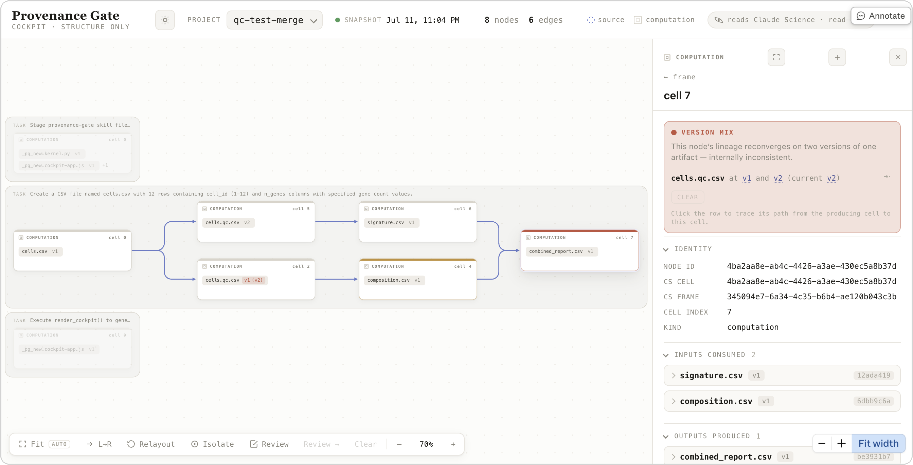

# provenance-gate

A deterministic trust gate for agentic science, running read-only over Claude Science (CS). It flags a
class of failure that's hard to catch by reading the output: a result quietly built on stale or
version-conflicting upstream data.

## The problem

An agent doing research over many turns forks approaches, revises an upstream step, and re-runs. Along
the way a conclusion can come to rest on an old version of a file, or on a report that combined two
divergent versions of the same artifact. Reading the final text, an LLM reviewer often has nothing to
go on, because the conflict is in the provenance, not the prose.

## What it does

The gate reads the CS provenance DAG and computes two verdicts for each computation cell:

- `stale_input` — the cell read a version of some artifact that is no longer current.
- `version_mix` — the cell's consumed lineage reaches two live versions of the same artifact.

Both are structural facts about the graph. No model decides them, so they aren't something an agent
can talk its way past. Green here doesn't mean the analysis is correct; it means the analysis rests on
current, consistent inputs.

These two checks are the deterministic core of a larger trust-gate design. The rest of that design,
and what we left out, is in [docs/DESIGN-RATIONALE.md](docs/DESIGN-RATIONALE.md).

## The surface

Six functions. Five are for the agent and return JSON; one renders the cockpit for a person.

| Function | What it answers |
|---|---|
| `audit_project()` | a verdict for every cell |
| `audit_input_lineage(files)` | before an expensive step, are these inputs and their lineage sound? |
| `review_chat()` | an evidence brief for what this conversation produced |
| `review_subgraph(nodes)` | a brief over hand-picked lineage |
| `review_selection(nodes)` | a brief over exactly the nodes you pick (a fork, minus a trunk you trust) |
| `render_cockpit(focus?)` | writes `cockpit.html` |

The cockpit shows the project DAG coloured by verdict (clean / stale / mix), with an inspector and a
conflict trace. You pick nodes by clicking, and "Review →" copies a `review_selection([...])` prompt
that you paste to the agent, which runs the brief and reasons over it. The rendered page can't call
the agent itself, so the paste is the bridge.



*The cockpit, rendered by the agent as a read-only artifact inside Claude Science. Cell 7 is flagged
`version_mix`; the panel names the conflict: `cells.qc.csv` reached at both v1 and v2.*

## How it's built

One pure `core/` (derive + audit) feeds two readers: a server adapter over the raw operon DB, and an
in-CS kernel over `host.query` that is inlined into a single zero-dependency file. Parity tests keep
the two deriving the same graph. Everything is read-only, and every verdict is a pure function of the
graph.

## Status

- Done: the two checks, all six functions, and the cockpit — tested and run against live CS projects.
- Not yet: publishing the skill, which is what lets the agent run the pre-write check on its own.
- Later: effectiveness numbers, from the eval-harness stream.

## Room to explore

Things we'd add next. Some were cut for time, some wait on the substrate (see
[docs/HEADROOM.md](docs/HEADROOM.md)):

- A faithfulness check — does a reported value match its frozen source. High signal, cut for time.
- Auto-detecting comparability sites: two arms of a shared root processed differently, so nobody has
  to spot the fork by eye. Today the cockpit selection plus the review hand-off does this by hand.
- A persisted attestation layer (assumptions, links a human owns), which needs a writable store.
- The autonomous pre-write trigger, once the skill is published.
- A live cockpit instead of a re-rendered snapshot.

## Where to look

- [docs/DESIGN-RATIONALE.md](docs/DESIGN-RATIONALE.md) — assumptions, the design decisions and why,
  scope, and limitations.
- `src/provenance_gate/core/` — model, derive, audit.
- `design/build_skill.py` — the build that inlines core into `kernel.py`.
- `ui/cockpit.html` — the cockpit.

## Develop

```sh
uv run pytest
uv run ruff check
```
